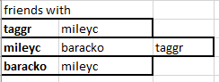
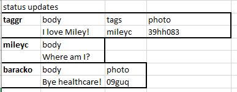
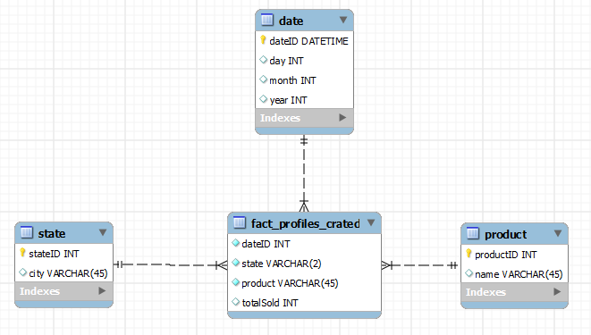

# 1: Cassandra
## Application = Simple Facebook Profiles
-	Facebook sells the service of self-expression via a customizable profile that keeps a structured format.
-	The data represents peoples’ experiences (photos), thoughts (status updates) and preferences (likes)

## Why Cassandra is the best fit
-	Cassandra is most suitable for content management.  Facebook profiles have a lot of content that is in the form of structured data, such as photo albums and status updates, which are almost like a mini-blogging system.  More reasons to use Cassandra include:
-	There is a vast population of users with Facebook profiles, so the fact that Cassandra handles data across many servers will be very beneficial.  This decentralization feature is also related to scalability, so when new machines are added, service can increase linearly.
-	A relational DBMS is not the best option because it will be slower in terms of read-write time, and not as flexible for storing and managing profile content.
-	Using HBase or Mongo would be a very similar experience, but Cassandra’s column family and keyspace models are more suited for structured document storage.  Hbase would encourage heavy use of Hadoop, which may not be wanted, and Mongo would probably be less scalable and slower.

## Column families:
-	Notes: the bold words are keys.  All values have a timestamp that is not shown for simplicity.






## CQL queries
``` SQL
INSERT INTO users (name, password, location)
VALUES ("Lana Del Rey", "tropico", "Cony Island, NY")

SELECT COUNT (*)
FROM users
WHERE location = "Hollywood, CA"

CREATE COLUMNFAMILY Users (
	KEY uuid PRIMARY KEY,
	name text,
	password text,
	email text,
	location text );
CREATE COLUMNFAMILY FriendsWith (
	KEY uuid PRIMARY KEY,
	Friends text );
CREATE COLUMNFAMILY StatusUpdates (
	KEY uuid PRIMARY KEY,
	body text,
	tags text,
	photo blob );
```
	
# 2: XML language

## Language Definition
- This model is general enough to represent any system that manages profiles with a picture, posts that can contain pictures, and friends or connections to other users with profiles.
- This model supports the `newPost` operation which allows a user to create a new post, and the `suggestedFriends` operation which suggests new connections for users based on the friends of their friends.

``` xml
<?xml version="1.0"?>
<profile>
	<name></name>
	<profilePhoto></profilePhoto>
	<newPost>
		<source></source>
		<tagBox></tagBox>
		<inputText></inputText>
		<inputPhoto></inputPhoto>
	</newPost>
	<posts>
		<post>
			<time></time>
			<location></location>
			<tags>
				<tag></tag>
			</tags>
			<body>
				<photo></photo>
				<text></text>
			</body>
		</post>
	</posts>
	<friends>
		<friend>
			<name></name>
			<profilePhoto></profilePhoto>
			<link></link>
		</friend>
	</friends>
	<suggestedFriends>
		<source></source>
		<inputFriends>
			<friendID></friendID>
		</inputFriends>
		<userID></userID>
	</suggestedFriends>
</profile>
```

## XML Schema
- This does not include types for attributes of operations.
- Photos are represented as a URI (string)

``` xml
<?xml version="1.0"? encoding="ISO-8859-1" ?>
<xs:schema xmlns:xs="http://www.w3.org/2001/XMLSchema">
	<xs:element name="name" type="xs:string"/>
	<xs:element name="photo" type="xs:string"/>
	<xs:element name="source" type="xs:string"/>
	<xs:element name="tag" type="xs:string"/>
	<xs:element name="time" type="xs:dateTime"/>
	<xs:element name="location" type="xs:string"/>
	<xs:element name="body" type="xs:string"/>
	<xs:element name="link" type="xs:string"/>
	<xs:element name="userID" type="xs:int"/>
	<xs:element name ="friendID" type="xs:int"/>

	<xs:element name="tags">
		<xs:complexType>
			<xs:list ref="tag"/>
		</xs:complexType>
	</xs:element>

	<xs:element name="post">
		<xs:complexType>
			<xs:sequence>
				<xs:element ref="time"/>
				<xs:element ref="location"/>
				<xs:element ref="tags"/>
				<xs:element ref="photo"/>
			</xs:sequence>
		</xs:complexType>
	</xs:element>

	<xs:element name="friends">
		<xs:complexType>
			<xs:sequence>
				<xs:list ref="friendID"/>
			</xs:sequence>
		</xs:complexType>
	</xs:element>

</xs:schema>
```

# 3: OLAP and Relational DB

## Relational Schema

<table>
<tr>

<td>
<table>
<tr><th> users </th></tr>
<tr><td> userID <b>PK</b> </td></tr>
<tr><td> name </td></tr>
<tr><td> email </td></tr>
<tr><td> password </td></tr>
<tr><td> location</td></tr>
<tr><td> time </td></tr>
</table>
</td>

<td>
<table>
<tr><th> friends </th></tr>
<tr><td> userID <b>PK</b> </td></tr>
<tr><td> friendID <b>PK FK</b> </td></tr>
</table>
</td>

<td>
<table>
<tr><th> posts </th></tr>
<tr><td> userID <b>PK FK</b> </td></tr>
<tr><td> body </td></tr>
<tr><td> time </td></tr>
</table>
</td>

</tr>
</table>

- Functional Dependencies:
- Multivalued Dependencies:

## OLTP Queries

Create a new user and automatically make them friends with the original user (MySpace model):

``` SQL
INSERT INTO users (name, email, password, location)
VALUES ("Kanye West", "ye@thebomb.com", "yeezus", "Chicago, IL");

INSERT INTO friends VALUES (1, 2);
```
A user can add the person as a freind who lives in Santa Barbara, CA with the most recent post:

``` SQL
INSERT INTO friends VALUES (1, 
(
	SELECT userID
	FROM users u JOIN posts p
		ON u.userID = p.userID
	WHERE u.location = "Santa Barbara, CA"
	ORDER BY p.time LIMIT 1
));
```

## Data Warehousing

### Schemas
**New relational schema to make this work** (I am adding a page table, in reference to facebook pages vs profiles)

<table>
<tr>

<td>
<table>
<tr><th> users </th></tr>
<tr><td> userID <b>PK</b> </td></tr>
<tr><td> name </td></tr>
<tr><td> email </td></tr>
<tr><td> password </td></tr>
<tr><td> location</td></tr>
<tr><td> time </td></tr>
</table>
</td>

<td>
<table>
<tr><th> friends </th></tr>
<tr><td> userID <b>PK</b> </td></tr>
<tr><td> friendID <b>PK FK</b> </td></tr>
</table>
</td>

<td>
<table>
<tr><th> posts </th></tr>
<tr><td> userID <b>PK FK</b> </td></tr>
<tr><td> body </td></tr>
<tr><td> time </td></tr>
</table>
</td>

<td>
<table>
<tr><th> pages </th></tr>
<tr><td> pageID <b>PK</b> </td></tr>
<tr><td> name </td></tr>
<tr><td> time </td></tr>
</table>
</td>

</tr>
</table>

**Star Schema:** for explaination of how it relates to the above schema, see below.



### Queries for Trends over Time

- Summarizes "sales" over time by state

``` SQL
SELECT dateID, state, SUM(totalSold)
FROM fact_profiles_created
GROUP BY state, dateID
```

- Summarizes "sales" of certain product type over time by state

``` SQL
SELECT product, dateID, state, SUM(totalSold)
FROM fact_profiles_created
GROUP BY product, dateID, state
```

- Summarizes "sales" by product type over a particular month in California

``` SQL
SELECT product, SUM(totalSold)
FROM fact_profiles_created f NATURAL JOIN date d
WHERE d.month = 8 AND f.state = "CA"
GROUP BY product
```

### Explaination of My Data Warehousing

- The sales table in the star schema is aggregating the number of times a new profile or page was created in the application.  The state table is storing the information related to the location of the profiles or pages that were created, while the product table is storing whether the thing created was a profile or a page.  The date table is keeping track of the timestamp representing the time of creation of a profile or page.
- The aggregation descibed above is done so summary queries can be written to analyze the data relating to the usage of the facebook-like app, and reveal trends over time.  This process is very different from online transaction processing (OLTP) because its only purpose is data analysis.  The data warehousing system should not modify records in the OLTP system in any way; it should only analyze them.  Relatively, the OLTP system should not be used to analyze any of its own data; it should only create, read, update, or delete it.

# 4: Assertions and Inferences

## Modified XML Language:

``` xml
<?xml version="1.0"?>
<profile>
	<home></home>
	<name></name>
	<profilePhoto></profilePhoto>
	<newPost>
		<source></source>
		<tagBox></tagBox>
		<inputText></inputText>
		<inputPhoto></inputPhoto>
	</newPost>
	<posts>
		<post>
			<time></time>
			<location></location>
			<tags>
				<tag>
					<friendID></friendID>
					<taggedBy>
						<userID></userID>
					</taggedBy>
				</tag>
			</tags>
			<body>
				<photo></photo>
				<text></text>
			</body>
		</post>
	</posts>
	<friends>
		<friend>
			<name></name>
			<profilePhoto></profilePhoto>
			<link></link>
		</friend>
	</friends>
	<suggestedFriends>
		<source></source>
		<inputFriends>
			<friendID></friendID>
		</inputFriends>
		<userID></userID>
	</suggestedFriends>
</profile>
```

## RDF Triples / Assertions

a post by mileyc should be tagged by mileyc
`www.myface.com/mileyc/posts/1432324 <taggedBy> www.myface.com/mileyc`

one of baracko's suggested friends should be taggr
`www.myface.com/baracko <suggestedFriends> www.myface.com/taggr`

any profile's home route should be the home page
`www.myface.com/profile/ <home> www.myface.com`

a new post's time should be the current time when it is created
`www.myface.com/lanar/posts/new <time> www.time.com/now`

a new post's location should be the location of the person who owns the post
`www.myface.com/kanyew/posts/new <location> www.kanyewest.com/mycurrentlocation`

taggr's profile photo shouuld be a photo he owns and in his 'profile' route
`www.myface.com/taggr <profilePhoto> www.myface.com/taggr/photos/profile`

the name on someone's profile should match their actual identity
`www.myface.com/mileyc <name> www.openid.com/9023841`

the input photo for a new post should come from someone's hard drive
`www.myface.com/lanar/posts/new <inputPhoto> C:\Users\LanaDelRey\Photos\`

# 5: Distributed Databases

# 6: Ambient Intelligence

Last summer, I went to Italy and had to ride a lot of trains.  I'm going to describe a higher-tech ticketing system than the one they currently have, in the same train stations that I visited.

## Description of System

- This system would be located in a train station
- The first part of the system would be touch-screen ticketing kiosks.  The user would purchase their ticket from at this kiosk and their thumbprint would be scanned, as a means of storing their identity.  The second part of the system would be a thumbprint reader on the actual train, which users would have to use in order to validate their ticket and board the train.
- The system adapts to a diverse population by requiring a standardized set of information to purchase a ticket.  Everyone who wants to use this system should have a means of purchasing a train ticket.  If a user did not have thumbprints, a backup identification method such as loading their identity into the system from a credit card should be possible, but I'm not going to worry about such a case for this example.
- The hardware involved would be thumbprint readers, credit card scanners, touch-screen computers, and web servers.

## Web Connectivity

- A web connection would be valuable to the users because the system could then email them reciepts or iteneraries.
- Users could also have the option of buying a ticket on a web-connected, fingerprint-enabled devise such as an iPhone 5S, and not have to go early to the station to use the kiosks.
- A web connection would be valuable to the implementers because it could provide information about the customers, which could lead to information helpful for marketing or other analytical purposes.
- A connection to the system's servers that host information about routes, available tickets, and purchases is necessary for the system's basic functions.

## Appropriate Database

The best database to back this system would be a relational database system such as MySQL.  This system's primary purpose is transactions, so the locks and various levels of transaction protocalls that MySQL supports would be necessary.  One transaction would be when a user purchases a ticket.  This would need to be stored in the database without any uncertanty that the row(s) were written.  The other transaction would be when a user checks in to the actual train.  This transaction would require less certainty and more speed than purchases, so a lower isolation level should be used.  Since there is not much else going on other than transactions, other types of databases would not be as valuable for this system.

# 7: Comparisons

| Database Name | Structure       | "Query" Method          | Transactions                 | Focus                                              |
|---------------|-----------------|-------------------------|------------------------------|----------------------------------------------------|
| Neo4J         | Graph           | Cypher Query Language   | full ACID support            | ease for common graph-like data                    |
| Mongo         | BSON/Document   | MongoDB CRUD Operations | Nested Documents             | large-scale document storage                       |
| MySQL         | Tables          | SQL                     | full rollback / ACID support | transactions, routine querying                     |
| Cassandra     | Column Families | CQL                     | 3rd Party additions required | Big Data, masterless decentralization, scalability |
| Hbase         | Colums          | Map-Reduce/Hadoop       | mostly ACID support (locks)  | scalability, clusters, big data                    |

